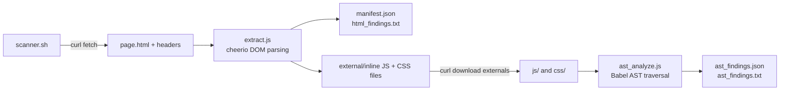

# JSA-TOOL_V1.0
<div align="center">

# 🔎 jsa-tool

**Client-side recon for JS, CSS, and HTML — real parsers, not regex.**


</div>

---

Point it at a URL (or a saved HTML file) and it pulls apart everything the
page ships client-side — external and inline scripts, stylesheets, forms,
comments, headers — then runs real AST analysis on the JavaScript instead
of grepping for patterns. Built as a first-pass recon helper for bug bounty
and VAPT work: it does the tedious DevTools trawl for you and hands back a
structured report to triage manually.

```
       _  _____  _____   _____
      (_)/ ____|/ ____| / ____|
       _| (___ | (___  | (___   ___ __ _ _ __  _ __   ___ _ __
      | |\___ \\___ \  \___ \ / __/ _` | '_ \| '_ \ / _ \ '__|
      | |____) |___) | ____) | (_| (_| | | | | | | |  __/ |
      | |_____/_____/ |_____/ \___\__,_|_| |_|_| |_|\___|_|
     _/ |
    |__/
:: Client-Side Asset Recon & Analysis (JS / CSS / HTML) ::
```

## Table of contents

- [Why this exists](#why-this-exists)
- [Features](#features)
- [Download](#download)
- [Usage](#usage)
- [Sample output](#sample-output)
- [Architecture](#architecture)
- [Known limitations](#known-limitations)
- [Roadmap](#roadmap)
- [License](#license)

## Why this exists

Regex against raw HTML/JS is brittle — it misses inline `<script>` blocks,
breaks on minified code, and can't reason about data flow. This tool uses
real parsers instead:

| Layer | Parser |
|---|---|
| HTML / CSS structure | [`cheerio`](https://cheerio.js.org/) (DOM parsing) |
| JavaScript | [`@babel/parser`](https://babeljs.io/docs/babel-parser) + `@babel/traverse` (AST traversal) |

## Features

**🌐 HTML-level** — `extract.js`

- External + inline `<script>` and `<style>`/`<link>` extraction
- HTML comments (frequent home for leaked internal paths, TODOs, staging URLs)
- Forms — action/method/inputs, flags password fields missing `autocomplete=off`
- Inline event-handler attributes (`onclick`, `onerror`, etc.)
- Meta tags — CMS/framework fingerprinting, CSP delivered via `<meta>`
- Mixed content (`http://` refs on an `https://` page)
- `<iframe>` without a `sandbox` attribute
- `target="_blank"` links missing `rel="noopener"` (reverse tabnabbing)
- Response-header security posture (CSP, X-Frame-Options, HSTS, cookie flags)

**⚙️ JavaScript, AST-based** — `ast_analyze.js`

- `eval()` / `Function()` calls
- `setTimeout`/`setInterval` called with a string argument
- `innerHTML`/`outerHTML` assignments — flagged **HIGH PRIORITY** when the
  right-hand side touches a known taint source (`location.hash`,
  `location.search`, `document.referrer`, `window.name`, etc.)
- `document.write()`/`writeln()` calls, same source-controlled check
- `postMessage()` calls using a wildcard `"*"` target origin
- `"message"` event listeners with no visible `.origin` check
- Dynamic `location.href` / `location =` assignments (non-literal targets)
- Hardcoded secrets — AWS keys, Google API keys, JWTs, Slack webhooks, generic bearer tokens
- API endpoint / path literals (`/api/`, `/v1/`–`/v3/`, absolute URLs)

## Download

```bash
git clone https://github.com/<your-username>/jsa-tool.git
cd jsa-tool
npm install
```

Requires **Node.js 18+** (for the built-in `fetch` API used by the local
scan path) and `curl` on your `PATH` (used by `scanner.sh` for the actual
target fetch — see [Architecture](#architecture) for why).

## Usage

```bash
./scanner.sh http://target-site.com/page.html
```

Or point it straight at a saved HTML file instead of hitting the network:

```bash
node extract.js saved_page.html output_dir "http://original-url.com/page.html"
```

Output lands in `scan_results_<timestamp>/`:

| File | Contents |
|---|---|
| `manifest.json` | Full structured HTML/CSS findings |
| `html_findings.txt` | Human-readable HTML-level findings |
| `ast_findings.json` / `ast_findings.txt` | AST-based JS findings |
| `js/`, `css/` | Downloaded external assets + saved inline blocks |

## Sample output

```
[+] Fetching target with curl...
[+] External JS found:    1
[+] Inline <script> found: 1
[+] HTML comments found:  1
[+] Forms found:          1
[!] Password field(s) without autocomplete=off
[!] Generator/CMS fingerprint exposed: WordPress 5.2
[!] 5 response-header security finding(s) — see html_findings.txt

[+] Running AST analysis (source/sink tracing, secrets, endpoints)...
=== js/app.js ===
  Endpoints/paths found (1):
    - /api/v1/data
  [!] innerHTML/outerHTML assignments (1):
    - line 2  [SOURCE-CONTROLLED VALUE — HIGH PRIORITY]:
      document.getElementById("out").innerHTML = location.search
```

## Architecture



`scanner.sh` fetches the target with `curl` rather than relying on Node's
built-in `fetch()`. On some networks (notably WSL2 with NAT64/IPv6
configurations) Node's `fetch()` (via `undici`) fails to fall back to IPv4
the way `curl` does, even with `--dns-result-order=ipv4first` set. Fetching
with `curl` first and handing the saved file to `extract.js` sidesteps that
entirely.

## Known limitations

- **Not full taint analysis.** The source→sink checks in `ast_analyze.js`
  work by checking whether a sink's argument *textually contains* a known
  source expression at the call site. Indirection through an intermediate
  variable (`var x = location.hash; ... ; el.innerHTML = x;`) won't be
  caught yet.
- **No CSS AST parsing yet.** CSS is currently parsed structurally via
  cheerio for `<style>`/`<link>` extraction, but property-level analysis
  (e.g. flagging `background-image: url()` combined with attribute
  selectors targeting password fields, or clickjacking-style `opacity: 0`
  + high `z-index` overlays) isn't implemented yet.
- **Single-page scans only.** No crawling — point it at one page at a time.

## Roadmap

- [ ] PostCSS/css-tree-based CSS property analysis
- [ ] Variable-binding tracking for real source→sink data flow
- [ ] Source map fetch + reconstruction of original (unminified) source
- [ ] Lightweight crawler for multi-page scans

## License

None — all rights reserved.
